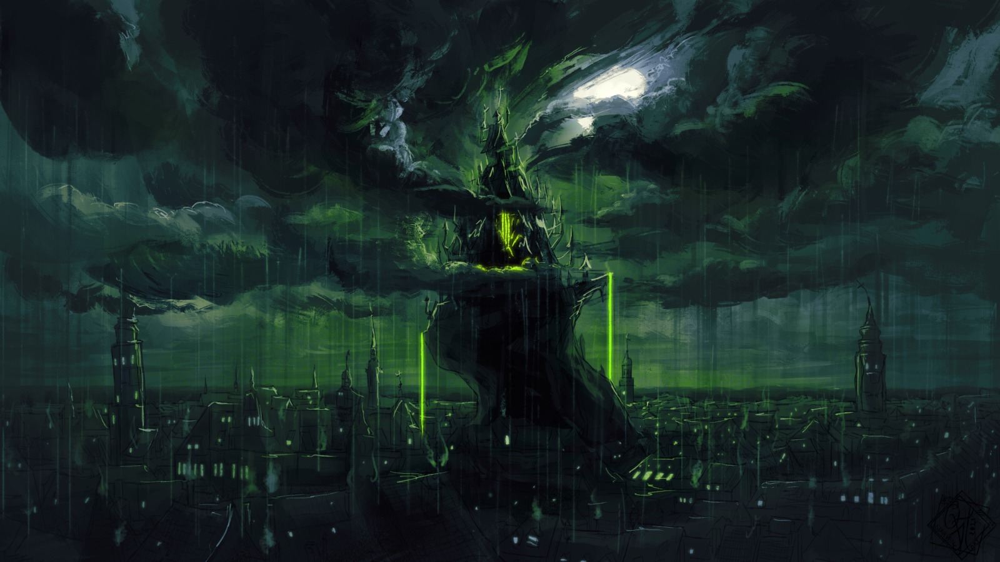

### Abstract

The project was about my split role as the Unreal Lead Developer of a fully Virtualized City Scene in Unreal Engine for the Shortfilm Eisspin and the Technical Direction of a Small team of fellow students. What initially started as a short yet challenging briefing - to generate a fictional "sick" city procedurally - turned into a full-time position spanning multiple semesters from which I matured into a reliable team partner with pragmatic solutions, as System Architect, Feature and Tools designer and developer and Development/Technical Art Supervisor. As an added bonus I connected with a fantastic team from all departments of the film university to create a truly stunning Student "Blockbuster"

### Concept

The Briefing was simple: Create a rotten/ill looking city with cinematic quality, based on the Author Walter Möhr's vision called Sledwaya, following the existing Art Direction of the Scenography and DOP, coordinating with a small team of artists to get modular 3D art assets.
There was already an existing scene for the project, however just a prototype which would have to change into a fully different direction.
Personally I wanted the City Architecture to be powerful enough to be regenerated at will and retain the ability to extend it with manual art direction. I took as inspiration the modular building system from the video game Spore: https://www.youtube.com/watch?v=vOOkvcPKdeg&t=197s At that point in time the description of these fantastical and somewhat surreal building designs reminded me of it the most. The city would then be used to create multiple extensive camera drives through the city towards and away from the main hero building: the Castle of the evil sorcerer Eisspin. The wish from the director was to go with a camera first approach to inform the remaining art direction based on the existing camera movement.
This set yet another feature requirement towards how we would implement cameras in the scene which would lead to greatly unorthodox camera workflow.
Finally great emphasis was placed on a dramatic weather, changing in mood inbetween shots.

### Results

The Project was integrated in a robust infrastructure. Main corner piece was the version control system Perforce hosted on a remote server for access over the internet and a decentralized workflow. This worked in conjunction with a local network share interconnecting three pc which were used to store big external assets not subject to versioning like those from the Mega Scan library.

In the end we had a highly modular scene built using the concept of `One File per actor` in Unreal Engine 5.0, to enable multiple users editing the same scene without Perforce locking out people from the remaining city file. The different settings for the 7/8 shots where managed using sequencers and a custom developed scene management widget, which allowed to hide/unhide actors tagged with a specific shot number and set the right sequence to reduce the cognitive load in a rather hectic workflow. This widget also gave access to the city generation layer, which could be regenerated on the press of one button.

The city was composed of a generative layer and a handcrafted section streamed in through a sublevel. The generative layer is composed of modular single buildings, initially as gray blocks which were placed along a city layout which was projected on the landscape using a decal. Once matching the art direction of the lead scenographer the system would then assemble pre built modular building "corpi" (plural of corpus) to unique somewhat crooked
looked buildings and then use props (doors, chimneys and windows) to add the final details along the normals of the building. The windows would also serve as the main light source during the night scene and have been implemented using a light abstraction enabling us to control them as a collection based on a distance function from the castle, setting colors in the range of very sick (green) to normal (warm white). This was also used in Shot 2 to coordinate a radial magical explosion which would extinguish all lights from the castle's epicenter. The special feature of the buildings was their transient nature as single actors and components, being instanced temporarily during the "design face" and then converted to a group of subactors when the designer wanted to commit them to the level. Giving us a tradeoff between performance and manual adjustability for art direction.
Around the city where multiple landscape chunks generated with World Builder and art directed using megascan props by our director and scenographers. A special feature of the landscape was a branching river system which was implemented using Unreal's new water system and carved into the landscape. It would also serve as a guideline for the camera drive along it and the city.

The camera drives where conceptualized and implemented as splines. This enabled us to always have a visual guideline of the path the camera would take through the level and have a reference for the city layout when placing details along the areas close to the camera.
A custom spline camera system has been developed to enable a dynamic roll system inspired by the flying behavior of how drone maneuvers using ideas from integrals from calculus to determine the stipness of the curve and dynamically evaluate the roll factor.
This would also feature the ability to manually overwrite the roll setting.

The spline methodology has been reused in three procedural assets which where crucial for the city aesthetic and level of detail:

1. An abstract (mesh and asset agnostic) spline layout sytem was used to place walls and stones around the city and the environment in a cohesive sequence. This tool was also used to create bridges over the aforementioned river.
2. A street asset could be used, not only to layout streets of different materials inbetween the buildings, but automatically place lamps, benches, barrels and other props on the side in irregular intervals facing the street. All light sources placed this way where of course part of the light management abstraction for the holistic light manager.
3. An aqueduct with a half pipe shaped tolopology and feets which would automatically extend to join to the floor. Inside the pipe was a procedurally generated fluid simulation using fluid ninja applied as material to convey the illusion of running toxic goo throughout the city 

The castle was a manually crafted high resolution model composed of hundreds of mesh components using UE 5.0 new Nanite Mesh system to dynamically adjust LODs to boost the performance.

Finally each shot was finished with a unique minutely hand crafted weather setting featuring hightdriven precipication fall (snow vs rain), thunderstorm with art directed position and moment of lighting. For this UDS has been dissected and extended to enable reproducible randomness and scripted triggering of lightings on the sequencer.

In addition to the conception, orchestration and implementation of all these components and their involved workflows I was responsible to mitigate version control conflicts, solve bugs and debug performance issues. 

### Reflections & Learning

What started as one simple feature, developed into a massive feature creep. The synergy between departments created a never ending feedback loop of implementations which defeated previous expectations that lead to the wish of exploiting the unexplored potential of an Unreal Engine driven workflow.
This experience not only showed me that, and how, my existing skillset, could be applied to a relatively unknown area to me: Film Production, but also the potential and limitations of doing so. I learned the ability and willingness to delegate tasks to people with a different skill set, so that I could focus on my personal strengths: keeping the big picture in mind and enabling a streamlined workflow through informed architectural decisions and debugging and custom algorithms. This made me an overall better team player and helped me develop an intuition to focus my passion to help other people perform better. It showed me how researching existing tools and rather focusing development effort on bridging the missing gaps, extending functionality, can increase productivity and leverage existing tool ecosystems to get quick and very impressive results. Yet a lot of adjustment and refinement is needed to match the expectations of all involved parties. 
One of the biggest challenges has been the wish for an art directed volumetric cloud system.
This was during a time where Open VDB was still in its Beta phase, and the unreal support was niche and only available at a late stage of development. Pairing this with the existing screen space driven cloud system of Unreal meant, that we had to swap out one layer for another and to stitch the final shot in post-production.
In hindsight I found out about existing procedural city tools implemented in Applications more suitable for that kind of job: Mainly Houdini and Blender. Teaching a valuable lesson of idiomaticity, a concept related to linguistic, which can be applied to development, stipulating that there is certain systems which are better suited to express certain ideas (expressions) then others. Strengthening also my understanding between the correlation of software architecture, tool development and resulting workflow.

